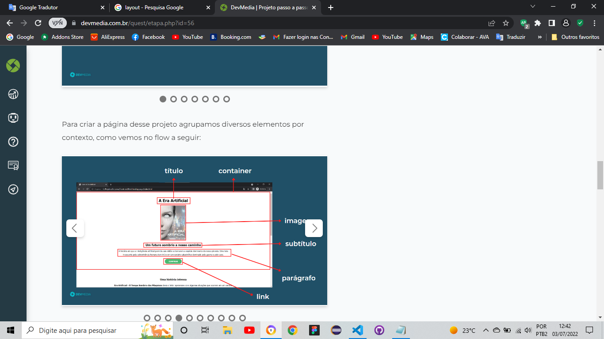

# Creating First Static Website
 Criando **Primeiro** Site estatico
 <meta name="viewport" content="width=device-width, initial-scale=1.0">

## Descrição em Português

_________________________
  Este projeto foi baseado em um layout entregue no projeto passo a passo na plataforma de ensino DevMedia, O formato Passo a passo  funciona da seguinte forma, é passado uma imagens do Produto final e em seguinte tem passos a serem conquistados com cards com pequenas descrições do que deve ser feito, sem muitos detalhes sobre o código com o incentivo para que o estudante crie o próprio código, o objetivo e chegar ao mesmo resultado ao final

  ## Description in English

  _________________________
This project was based on a layout delivered in the step-by-step project on the DevMedia teaching platform. that must be done, without much detail about the code with the incentive for the student to create their own code, the objective and to reach the same result in the end

 Na imagem acima, temos um exemplo de como são os Cards explicativo

link para ,layout de como deveria ficar ,a estrutura da Pagina Principal:
<https://www.devmedia.com.br/arquivos/projeto_guiado/front-end/primeira_pagina_web_pousada/layout-pagina-principal-html.jpeg>

 lista de Tarefas:

- [x] Estrutura da pagina 
- [X] Estlizar com css a pagina principal
- [X] Fazer estrutura pagina dos Quartos
- [X] Css da pagina dos quartos
  
### Imagem de como ficou:

_________________________

